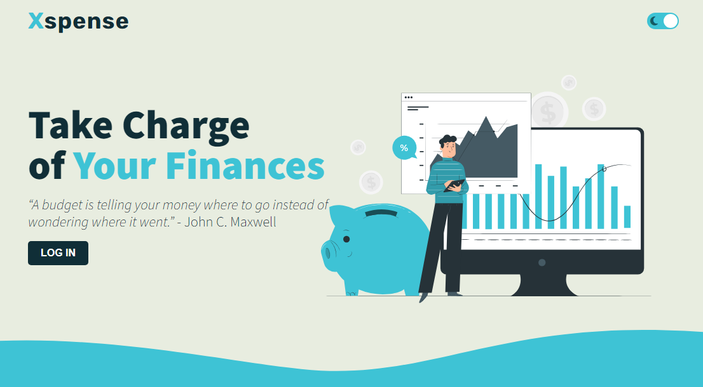

# Xpense App

## [Live Demo](https://xpense-3re8.onrender.com/)

## Project Idea:
Personal finance management tool that helps users manage their money by keeping track of their expenses.

The app allows users to set up a budget for different categories such as rent, groceries, entertainment, etc. and track their spending against the budget. 

## Project Requirements:
1. Flask web framework.
2. One or more Python modules.
3. One or more classes.
4. Use local storage.
5. Writes and reads from file.
6. Takes input from user.

## Details:
1. Will use (Flask, Jinja, Session, sqlite3)
2. User authentication. Sign up and login forms.
3. The user can create many budgets, then adds expenses related to each budget.
4. Show a table with history of every item the user has added.
5. Landing page will have a quote that gets fetched from a local json file.
6. Users can delete entries.

## How to run:
1. Install Python (https://www.python.org/downloads/)
2. Install dependencies, open the terminal in the project folder and run:
 ```python
  pip install -r requirements.txt
  ```
3. Then run the app with:
```python
flask run
```